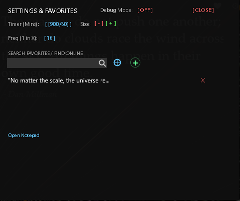

# Sophisticated Quote Manager for Rainmeter

A highly advanced, interactive Rainmeter skin for displaying, managing, and curating inspirational quotes.

This project is a heavily modified and expanded version of the original [**Static Quotes**](https://github.com/alestrunda/static-quotes) by **alestrunda**. It builds upon the original concept with a robust favorites management system, custom inputs, and dynamic UI scaling.

[**Version**](https://img.shields.io/badge/version-1.0-blue) [**Rainmeter**](https://img.shields.io/badge/Rainmeter-Skin-green) [**License**](https://img.shields.io/badge/license-CC%20BY--NC--SA%203.0-lightgrey)

## 📸 Gallery

  

  <b>Above:</b> The Quote Manager seamlessly integrated into a desktop environment.

  
  

  <b>Left:</b> The clean main display. <b>Right:</b> The Settings \\\\\\\& Favorites Manager.

## ✨ Features

### 🧠 Smart Quote Engine

* **Online Source:** Fetches fresh quotes automatically from the [ZenQuotes API](https://zenquotes.io/).
* **Smart Frequency:** Configure how often you want to see your saved favorites versus new online quotes (e.g., "Show a favorite every 4th refresh").
* **Auto-Cleaning:** Automatically strips weird formatting and line breaks from text.

### ❤️ Favorites Manager

* **Save \& Keep:** Click the **Heart** icon to save any quote instantly to a local database.
* **Visual Indicators:** A **Gold Star** appears automatically when a displayed quote is already in your library.
* **Searchable List:** A built-in settings menu allows you to scroll through, search, and delete specific quotes from your saved list.

### ➕ Custom Quote Entry

* **Manual Addition:** Add your own personal quotes via a dedicated "Add Panel" (Click the `+` button).
* **Strict Input Form:** Features a two-step input box (Quote -> Author) that prevents accidental data loss if you click away.
* **Web Search:** Includes a "Find Online" button to quickly search Google for quotes to copy-paste.

### 🎛️ Customization \& UI

* **Dynamic Scaling:** Built-in **\[ + ]** and **\[ - ]** zoom buttons to resize the entire interface to fit your desktop.
* **Timer Control:** Set your preferred refresh interval in minutes directly from the UI.
* **Persistent State:** The menu remembers if it was open or closed when the skin refreshes.
* **Interactive Design:** All buttons feature hover effects and generous "hitboxes" for easy clicking.

## 📥 Installation

1. Ensure you have [Rainmeter](https://www.rainmeter.net/) installed.
2. Download this repository.
3. Place the folder into your Rainmeter Skins directory (usually `Documents\\\\\\\\Rainmeter\\\\\\\\Skins\\\\\\\\`).
4. Open Rainmeter and load `StaticQuote.ini`.

## 🎮 How to Use

* **Heart Icon:** Toggles the current quote as a favorite.
* **Gear Icon:** Opens the Settings \& Manager menu.
* **Plus (+):** Opens the form to add a custom quote manually.
* **Globe Icon:** Opens a web search for quotes.
* **Clicking Text:** Refreshes the skin to show a new quote immediately.

## 🤝 Credits

* **Original Codebase:** [Static Quotes by alestrunda](https://github.com/alestrunda/static-quotes)
* **API:** Quotes provided by [ZenQuotes.io](https://zenquotes.io/)

## ⚖️ License

This project is licensed under the **Creative Commons Attribution-NonCommercial-ShareAlike 3.0 Unported (CC BY-NC-SA 3.0)**.

You are free to:

* **Share** — copy and redistribute the material in any medium or format.
* **Adapt** — remix, transform, and build upon the material.

Under the following terms:

* **Attribution** — You must give appropriate credit.
* **NonCommercial** — You may not use the material for commercial purposes.
* **ShareAlike** — If you remix, transform, or build upon the material, you must distribute your contributions under the same license as the original.
